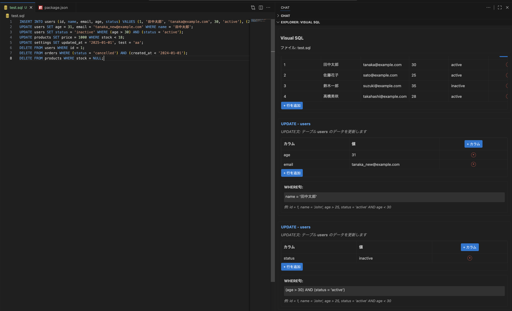

# Visual SQL    

SQLファイルをテーブル形式で視覚的に編集できるVSCode拡張機能です。

## 機能

- INSERT文、UPDATE文、SELECT文の視覚的な表示
- テーブル形式でのデータ編集
- セルの直接編集
- 行の追加・削除
- カラムの追加・削除
- カラム名の編集
- リアルタイムでのSQL更新

## 使い方

1. `.sql`ファイルを開く
2. サイドバーの「SQL Viewer」パネルを確認
3. テーブル形式でデータを編集

## サポートされるSQL文

- INSERT INTO
- UPDATE
- SELECT

## スクリーンショット

## 要件

- Visual Studio Code 1.105.0以上

## 既知の問題

現在、既知の問題はありません。

## リリースノート

### 0.0.1

初回リリース